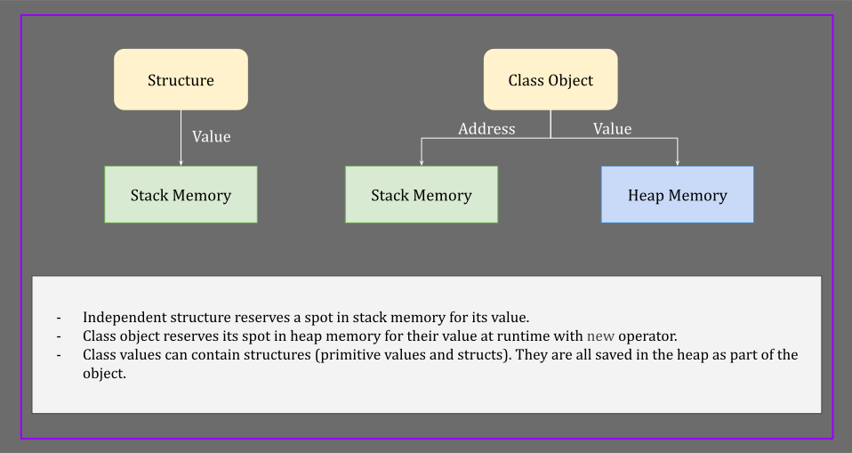
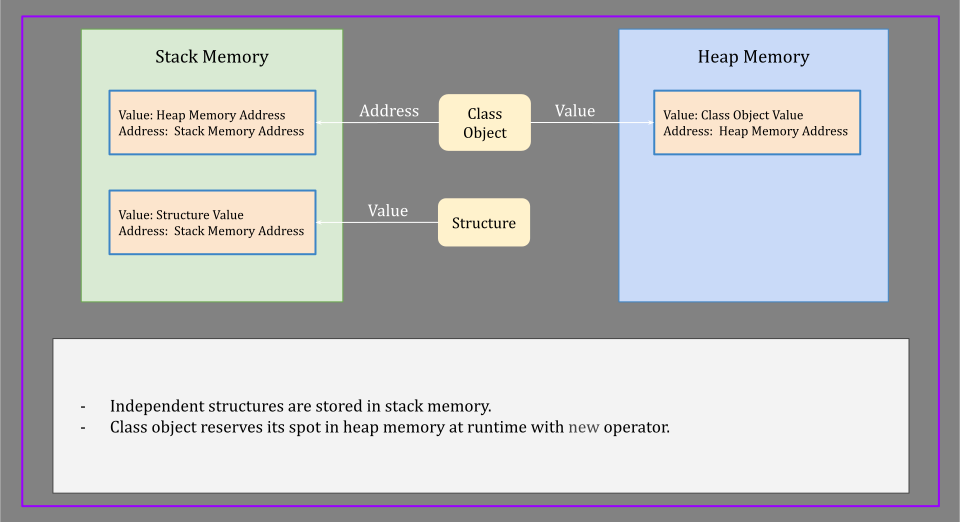

# C# Basics
- [.Net Ingredients](#net-ingredients)
- [CLR](#clr)
- [Namespace](#namespaces)
- [Assembly](#assembly)
- [Application](#application)
- [System](#system)
- [Main Method](#main-method)
- [Constant Variables](#constant-variables)
- [Variables](#variables)
- [Overflowing](#overflowing)
- [Conversion](#conversion)
  - [Implicit Conversion](#implicit-conversion)
  - [Explicit Type Conversion (Casting)](#explicit-type-conversion-casting)
  - [Non-compatible Types](#non-compatible-types)
- [Operators](#operators)
- [Comments](#comments)
- [Class](#class)
- [Struct](#struct)
- [Array](#array)
- [String](#string)
  - [Format String](#format-string)
- [Enums](#enums)
- [Structures VS Classes](#structures-vs-classes)
- [Conditional Statements](#conditional-statements)
  - [If Statement](#if-statement-syntax)
  - [Switch / case](#switch--case-syntax)
- [Iteration Statements](#iteration-statements)
  - [For Loop](#for-loop)
  - [Foreach Loop](#foreach-loop)
  - [While Loop](#while-loop)
  - [Do While Loop](#do-while-loop)
- [Read from and write to the console](#read-from-and-write-to-the-console)
- [Random Class](#random-class)
- [More On Arrays](#more-on-arrays)
- [List](#list)
- [DateTime](#datetime)
- [TimeSpan](#timespan)
- [Text & String](#text--string)
- [StringBuilder](#stringbuilder)
- [Procedural Programming](#procedural-programming)
- [Object-Oriented Programming](#object-oriented-programming-oop)
- [Files and Directories](#files-and-directories)

<a id="dot-net-components"></a>
## .Net Ingredients
.Net is made of two components:
1. CLR (Common Language Runtime)
2. Class Library (for building applications)


In C and C++:  code -> compiler -> native code

In Java:  code -> compiler -> ByteCode -> native Code

In C#: code -> compiler -> IL Code (intermediate language) -> native code

Note: ByteCode and IL Code are independent of computer which it’s running

<a id="clr"></a>
### CLR 
- Translates IL code to native code
- It is in fact an application itself that you install on your machine
- The process of translation is called Just-in-time Compilation (JIT)

<a id='namespace'></a>
###  Namespaces 
- A container for related classes

<a id='assembly'></a>
### Assembly
- A container for related namespaces
- It is a file on the disc
- It can be DLL (dynamically linked library)
- It can be an executable (EXE file)

<a id='application'></a>
### Application
- A container of one or multiple assemblies

<a id='system'></a>
### System 
- A namespace in .Net framework
- All utility classes and primitive types are there
- System.Collections.Generics: library to work with lists, collections, and so on
- System.Linq is used to work with data
- System.Text is used to work with text, coding, etc.
- System.Threading to build multithreading applications

<a id='main-method'></a>
### Main method 
- CLR needs to find a method called “Main” in a class called Program in a 
file named Program.cs
- Main is static and does not return anything (=void)
- Main can accept a string array argument. (string[] args)
```csharp
public class Program 
{
    public static void main(string[] args) 
    {
        // code goes here
    }
}
```

<a id='constant-variables'></a>
### Constant Variables 
- `const <data-type>  <identifier> = <value>; `
- Constant identifiers are either PascalCase or all CAPITAL letters.
- Hardcoded constants:
  - They are compiled-time constants
  - Naming convention: underscore seperated all CAPITAL words
    ```csharp
    const double PI = 3.141592;
    ```
- Constants calculated at runtime:
  - Naming convention: PascalCase
    ```csharp
    using System;
					
    public class Program
    {
        public static readonly DateTime MarchFirst = new DateTime(2015, 03, 01);
        public static void Main()
        {
            Console.WriteLine(MarchFirst);
        }
    }
    ```
- Modifying a constant would cause a compiler error

<a id='variables'></a>
### Variables 
- Syntax 1: `<data-type> <identifier> = <value>;`
- Syntax 2: `var <identifier> = <value>;`
- In the second syntax, the variable type will be interpreted by the compiler.
- Variable identifiers are camelCase
- Primitive Data types:

|   C#    |  .Net   | Bytes |            Range            |
|:-------:|:-------:|:-----:|:---------------------------:|
|  byte   |  Byte   |   1   |           0 - 255           |
|  short  |  Int16  |   2   |       -32000 - 32000        |
|   int   |  Int32  |   4   |        -2.1B - 2.1B         |
|  long   |  Int64  |   8   |              …              |
|  float  | Single  |   4   | -3.4 * 10^38 - +3.4 * 10^38 |
| double  | Double  |   8   |              …              |
| decimal | Decimal |  16   | -7.9 * 10^28 - +7.9 * 10^28 |
|  char   |  Char   |   2   |     Unicode Characters      |
|  bool   | Boolean |   1   |         true/false          |

#### Note: Int16 contains 16 bits or two bytes. Same logic applies to Int32 and others

<a id='overflowing'></a>
### Overflowing 
- Example:
  ```csharp
  byte brightness = 255;
  brightness += 1;
  // result would be 0 instead of 256
  ```
- C# does not have automatic check for overflowing since it may happen in 
runtime
- Use “checked” if you want to throw an exception if overflow happens
- Example
    ```csharp
    checked 
        { }
    ```

<a id='conversion'></a>
## Conversion

<a id='implicit-conversion'></a>
### Implicit Conversion 
- Convert without asking
- Possible only if the byte size is increasing
- It won't implicitly convert if there is a chance of data loss
- Example: assignment of byte to int
- Example: assignment of int to double

<a id='explicit-type-conversion-casting'></a>
### Explicit Type Conversion (Casting) 
- Use it only if you are sure there will be no data loss
- If not explicitly asked => compiler error
- For example, we expect age to be less than 255. Then we can explicitly convert it from int to byte.
  ```csharp
  byte age = (byte)calculatedIntAge;
  ```
- Be aware of possible data loss when casting explicitly
- Example:

|                 int                  | Convert to |     byte      |
|:------------------------------------:|:----------:|:-------------:|
|                 	259                 |    ->	     |       3       |
| 	00000000 00000000 00000001 00000011 |     ->     | 	    00000011 |

- Casting a character to integer will return its integer ASCII code
  ```csharp
  var code = (int) ’a’;
  ```

<a id='non-compatible-types'></a>
### Non-compatible Types 
- Explicit casting won’t work for them
- Example: string to integer
- How to convert:
  1. Method one: use “Convert” class from “System” namespace
     ```csharp
     int age = Convert.ToInt32(ageJson);
     ```
     - Note: from the method name, it appears that Convert class is part of **.Net** framework
     - Other methods of the Convert class:
         - `ToByte()`
         - `ToInt16()`
         - `ToInt32()`
         - `ToInt64()`
     - Example: bool decision = Convert.ToBoolean(“true”);
  2. Method two: use C# Parse method:
     ```csharp
     int age = int.Parse(s);
     ```
     - Parse is a C# method

<a id='operators'></a>
### Operators 
- Arithmetic:  +  -  *  /  %   ++   --   
    - Postfix increment: int b = a++;
        - "a" would be one number greater than "b"
    - Prefix Increment: `int b = ++a;`
        - "a" would have equal value as "b"
    - Same logic for decrement
- Comparison:  ==  !=  >  >=  <  <=
- Assignment: =  +=  -=  *=  /=
- Logical:  &&  ||   !
    - Note: avoid nested not operator: !(a >= b) => use instead: (a < b)
- Bitwise (should be avoided):  &  |   

<a id='comments'></a>
### Comments 
- Single line: anything after // in the line
- Multiline: /* all lines and words between these two signs */
- Do not explain what the code is doing in comments
- Only explain whys, hows, constraints and not whats.
- Comments do not get compiled. They will be skipped by the compiler. 

<a id='class'></a>
### Class
- A blueprint from which we create objects
- Made of fields (attributes) and methods (functions)
- Fields define the state of a class
- Methods define the behaviour of a class
- Object is an isolated instance of a class
- Define a class: `<access-modifier> class <identifier> {}`
  ```csharp
  public class Person {}
  ```
- Use `new` operator to create an object of a class
    - `new` operator allocates a space in memory for the object at runtime.
    - Example: create an instance (object) of the class “Person”
        ```csharp
        Person psn = new Person();  // syntax one
        var psn = new Person();  // syntax two
        ```
    - Note: In the first syntax, the first “Person”  is type (class name) and second “Person” is constructor call
    - CLR takes care of allocating memory and freeing it at runtime.

<a id='static'></a>
### Static 
- A static member (method or field) of a class can be accessed through 
class itself
- There is no need to create an object of class to access a static member 
of it.
- We cannot access static members through the objects
- There is only one instance of static member in memory and that is in 
class itself.
- Static members are also called class members. (class method, class 
attribute)

<a id='struct'></a>
### Struct 
- Declaration: `<access-modifier> struct <identifier> {}`
- Supports both fields and methods
- Suitable for creating large number of tiny objects
- It’s a better practice to use classes for most (99%) of applications
- Class objects are reference based but struct objects are value based

<a id='array'></a>
### Array
- Array is a non-primitive type
- An array is a data structure to store a collection of values of the same type
- Arrays have fixed size. You need to specify the size in declaration, and it cannot be changed.
- You need to allocate memory for arrays when declaring them. Use `new` operator for it.
- Arrays are objects of the `Array` class. `Array` is a generic class.
  ```csharp
  int[] numbers = new int[3];
  var names = new string[2] {“John”, “Jane”};
  var firstNames = new string[] {“John”, “Jane”}; // still the size is fixed. It’s implicit
  ```
- Use object initialization syntax if you know the values of entities in the array:
- Use square brackets to read from and write to an entity of an array by index
- Indexes start from 0
  ```csharp
  int[] numbers = new int[3] {1, 2, 3};
  int firstNum = numbers[0]; // read element
  number[0] = 4;  // write to element
  ```
- If declared but not initialized, entities of an array would be set to zero value of the array type
- Zero value for numbers is zero, for string is null and for boolean is false.

<a id='string'></a>
### String 
- A sequence of characters
- String (with capital s) => a class in .Net, string => C#
- Use double quote for string literal
  ```csharp
  string firstName = “John”;
  ```
- Concatenate strings with plus operator:
  ```csharp
  string fullName = firstName + “ “ + lastName;  
  ```
- Recommended: use string format instead of + operator (because strings are immutable)
  ```csharp
  string fullName = string.Format(“{0} {1}”, firstName, lastName});
  ```
    - Note: placeholders 0, 1, etc are zero indexed. 
- Strings are immutable (read only after creation). It means that any operation on strings will generate new strings rather than changing the original ones.
  ```csharp
  char firstChar = name[0]; // no error
  name[0] = ‘D’; // compile error
  ```
- Escape characters: 
    - `\n` => new line
    - `\t` =>  tab
    - `\\\` => backslash
    - `\’` => single quotation
    - `\”` => double quotation
- Verbatim strings: 
    - no character can scape in it
    - Starts with `@`
    ```csharp
    string path = @“c:\users\projects\directory”;
    ```
- Join all items in an array with a separator between them
  ```csharp
  String.Join(separator, array);
  ```
- Length of a string as an integer: 
  ```csharp 
  fullName.Length
  ```
- One string constructor overload to create a string accepts a character 
array as argument
    ```csharp
    var name = new string(array);
    ```

<a id='format-string'></a>
#### Format string 
  ```csharp
  string.Format(“{0} {1}”, byte.MinValue, byte.MaxValue);
  console.WriteLine(“{0} {1}”, float.MinValue, float.MaxValue);
  ```

<a id='enums'></a>
## Enums 
- A set of name / value pairs (constants)
- Declaration: `<access-modifier> enum <identifier> {}`
- Values are integers
- Identifier should be PascalCase. Because it’s a constant
- Items are comma separated. Semicolon after the latest item.
- Example:
    ```csharp
      public enum WeekDay 
      {
          Sunday = 1,
          Monday = 2,
          Tuesday = 3,
          Wednesday = 4,
          Thursday - 5,
          Friday = 6,
          Saturday = 7;
      }
    ```

- If values (1, 2, …) are not given, it will start from zero by default.
- The element with value of zero is the default item. If there is no zero value, then the first item is the default item.
- To get the default item: `default(WeekDay)`. In our example it is `Sunday`
- Usage: with dot notation `var day = WeekDay.Wednesday;`
- Note: type of day variable is WeekDay. It is cast-able to integer
- To declare a byte Enum: `public enum Weekday : byte {} `
- To convert day to string: `day.ToString();`
- Note: `Console.WriteLine(day);` calls the ToString() method of the day object internally
- To convert string (exp: “Friday”) to WeekDay enum: `var day2 = (WeekDay) Enum.Parse(typeof(WeekDay), “Monday”);`
- Enum class is in System namespace
- `Enum.Parse()` converts value to the type Enum. It returns an object type that can be downcast to WeekDay

<a id='structures-vs-classes'></a>
## Structures VS Classes 


- Primitive types and custom structs are structures
- Arrays, strings and custom classes are classes
- Structures are value types. Classes are reference types 
- When you declare a value type, a part of stack memory gets allocated for it automatically
- When a value type is out of scope, it gets removed from stack immediately by runtime (or CLR)
- For reference types, programmer needs to allocate memory with new operator.
- If a reference type contains a value type (object fields of structure type), values are part of the object and are saved in the heap memory.
- Value types go where they are declared. If declared independently, they are saved in stack memory. If they are part of an object, they are saved in the heap.
- Memory gets allocated for reference type from heap
- If a referenced type object goes out of scope, it continues to stay on heap for a little while
- CLR (= runtime) runs a process called garbage collection to free objects from heap.
- Assignment of value types copies their value to a different memory address. The two values become independent.
- A reference type object has values in heap and address as a different value in stack
- Assignment in reference type objects copies their stack memory values which is the address to heap memory object.
- Passing a value type variable to a function as argument would copy its value to a new variable in that function scope. It will end up with two variables with the same value but two different copies in stack with two different scopes. (Even if they have the same name)
- Passing a reference type object to a function as argument would copy its address to a new variable in that function scope. Both variables in two scopes (inside and outside of the function) will point to the same space in heap (value). Changing object properties in either scope would change the value in the same heap memory space.



<a id='conditional-statements'></a>
## Conditional Statements 

<a id='if-statement-syntax'></a>
### If Statement Syntax 
  ```
  if (logical condition)
  {
    statement;
  }
  else if (logical condition 2)
  {
    statement 2;
  }
  else
  {
    statement 3;
  }
  ```
- If a statement is only one line, there would be no need for curly braces
- Example: 
    ```
    if (logical condition)
        statement;
    ```
- You can have as many ```else if``` conditions as you want
- If statements can be nested. Do your best to avoid nested if statements

<a id='switch--case-syntax'></a>
### Switch / case syntax 
  ```
  switch(variableName)
  {
    case value1:
      multi-line indented statement
      break;
    case value2:
      multi-line indented statement
      break;
    case value3:
    case value4:
      multi-line indented statement
      break;
    default:
      multi-line indented statement
      break;
  }
  ```
- You can have as many cases as you want
- If break is not specified all statements after the first matching 
condition will be run
- Switch / case is equivalent to if / else if / else statement
- One use case of switch / case is matching a value with an enum.
- Default will be run only if no case condition is satisfied.

<a id='iteration-statements'></a>
## Iteration Statements 

<a id='for-loop'></a>
### For loop 
- Suitable to work with indices. 
- It loops over until a logical statement is correct
- Syntax:
  ```
  for (var i = 0; i <= 20; i++)
  {
      statement;
  }
  ```
  - The first part (var i = 0) is called initialization clause
  - The second part (i <= 20) is called the condition clause
  - The third part (i++) is called the iteration clause
  - If the statement is only one line, then you can omit the curly braces
  - Iteration could also be a decrement. (Start from 20 and decrement to 0)

<a id='foreach-loop'></a>
### Foreach loop 
  - To iterate over elements of an enumerable object
  - Syntax: assume numbers is an array of numbers
    ```
    foreach (var number in numbers)
    {
        statement;
    }
    ```
      
  - If the statement is only one line, then you can omit the curly braces
  - You can run a foreach loop over characters of a string

<a id='while-loop'></a>
### While loop 
- It only has condition clause
- It checks the condition before running each loop
- It stays in the loop as long as the condition is true
- The initialization clause should be outside and before the while loop
- The iteration clause should be inside the while loop statements
- Syntax:
  ```
  var i = 0;
  while (i < 10)
  {
      statement;
      i++;
  }
  ```
- Iteration could also be a decrement. (Start from 10 and decrement to 0)
- If no increment (iteration clause) or a break provided, the loop will never end. It is called an infinite loop.

<a id='do-while-loop'></a>
### Do-While loop 
- Similar to while loop, but it checks the condition after running each loop
- Syntax:
  ```
  var i = 0;
  do
  {
      statement;
      i++;
  } while (i < 10);
  ```
- Do-while loop will run the inner statement at least once 
- Break: “break;” can be used to break out of the loop
- Continue: “continue;” can be used to skip the rest of the current statement and go to the next loop.
- Example:
  ```
  var i = 0;
  while (i < 20)
  {
      if (i % 2 ==0)
          continue;
      executeFunction1();
      if (userAbort())
          break;
  }
  ``` 

<a id='read-from-and-write-to-the-console'></a>
### Read from and write to the console 
- Console.WriteLine(“string content”);
- Console.Write(“without breaking the line”);
- var input = Console.ReadLine();
- input type is string
- Always check the input with: ```if (String.IsNullOrWhiteSpace(input)) {}```

<a id='random-class'></a>
## Random Class 
- A class of System namespace
- First you need to create an object of the class
- Then you can get a random integer, byte array or a double between 0 and 1 by calling the Next(), NextBytes(), and NextDouble() method
- Example:
    ```
    var random = new Random();
    var randomInt = random.Next();
    var randomByteArray = random.NextBytes(array);
    var randomDouble = random.NextDouble()
    var character = (char) (‘a’ + random.Next(0, 26));
    ```

<a id='more-on-arrays'></a>
## More On Arrays 
- Fixed number of elements of the same type
- They are stored in adjacent spots in memory. This would provide random access in constant time.
- Initializing an array with all zero values:
    - ```var numbers = new int[20];```
- Initializing an array if values are known at the time of initialization:
    - ```var numbers = new int[5] {1, 2, 3, 4, 5};```
    - ```var numbers = new[] {1, 2, 3, 4, 5};``` // length is set implicitly, and it’s fixed. Same for type
- Multi dimensional array:
    1. Rectangular array: number of columns in all rows are equal (a matrix)
       - Declaration: ```var matrix = new int[3, 5];```
       - Declaration:
       ```
       var matrix = new int[2, 3]
           { {1, 2, 3},
           {4, 5, 6} };
       ```
       - Access an element: ```var element = matrix[0, 2];```
       - A three-dimensional array: ```var matrix = new int[2, 3, 4];```
    2. Jagged array. Each row can have an arbitrary number of columns.
       - Jagged array is like a single dimensional array where each element is a single dimensional array itself. 
       - Declaration:
       ```
       var array = new int[3][];                         
       array[0] = new int[4];
       array[1] = new int[2];                   
       array[2] = new int[7];
       ```
       - Access an element: ``` var element = array[2][6]; ```
- CLR in C# is optimized for single dimensional arrays. Then Jagged arrays are slightly faster that rectangular arrays.
- Array object properties: Length, 
- Array static methods: Clear(), Copy(), IndexOf(); Reverse(), Sort(), …
- Clear() is a static method which sets elements to zero value or null for reference types

<a id='list'></a>
## List 
- A collection of elements of the same type
- Part of System.Collection.Generic namespace
- List has a dynamic size. You can add or remove elements to it.
- List is a generic type (indicated by angle brackets <>)
- Declaration:
  ```
  var numbers = new List<int>();
  var numbers = new List<int>() {1, 2, 3, 4, 5};
  ```

- Useful object methods: Add(), AddRange(); Remove(), RemoveAll(), IndexOf(), LastIndexOf(), Contains()
- Length as object (non-static) attribute: numbers.Count
- Example: ```numbers.AddRange(new int[3] {2, 3, 5});```
- AddRange() can accept an array or a list as input
- Clear() is a non-static method that removes all element of the list => Count = 0;

<a id='datetime'></a>
## DateTime 
- A class in System namespace
- Constructor has many overloads
- Example: ```var dateTime = DateTime(2015, 05, 26);```
- Get current date time: var now = DateTime.Now => static property that create an object
- Object properties: Hour, Minute, …
- DateTime objects are immutable. You can use Add methods to add days, hours, etc to a date time object (use negative numbers to go to past)
- Object methods: ToLongDateString(), ToShortDateString(), ToLongTimeString(), ToShortTimeString(), ToString() // short date + long time, ToString(\<format-specifier>)
- Example: ```now.AddDays(-50).ToString(“yyyy-MM-dd HH:mm”);```
- Google C# daytime format specifier

<a id='timespan'></a>
## TimeSpan 
- Represents a length of time
- Declaration: ```var timeSpan = new TimeSpan(1, 2, 3); // 1h 2m 3s```
- TimeSpan constructor has many overloads
- Static Properties: to create objects easier: FromDays, FromSeconds, FromMinutes, etc
- Example: equivalent statements:
    - ```var timeSpan1 = new TimeSpan(1, 0, 0);```
    - ```var timeSpan2 = TimeSpan.FromHours(1);```
- Subtracting or adding two DateTime objects will create a TimeSpan object
- Object properties: Minutes, TotalMinutes, Seconds, TotalSeconds, …
- A TimeSpan object is immutable
- Object methods: Add(anotherTimeSpan), Subtract(anotherTimeSpan), 
ToString();
    - Example: timeSpan.Add(TimeSpan.FromMinutes(8));
- Convert string to TimeSpan: TimeSpan.Parse(“01:02:03”);

<a id='text--string'></a>
## Text & String 
- string keyword (C# version) maps to String class of .Net
- Strings are immutable
- Useful methods: 
    - Formatting: ToLower(), ToUpper(), Trim()
    - Searching for character or string: IndexOf(), LastIndexOf()
    - Create a substring: Substring(startIndex), Substring(StartIndex, length)
    - Replacing a character or substring: Replace(old, new)
    - Null Checking (static): String.IsNullOrEmpty(str), String.IsNullOrWhiteSpace(str). The second method checks for null, empty and whitespace.
    - Splitting to array of strings: str.Split(‘\<separator>‘) 
    - Parse to a non-compatible type: int.Parse(str), Convert.ToInt32(s)
    - Convert to string: call ToString() method or String.Format()

| Number |         Method         |                      String                       | 
|:------:|:----------------------:|:-------------------------------------------------:|
|  1234  |   number.ToString();   |                      “1234”                       |
|  1234  | number.ToString(“C”);  |      “$1,234.00” => working with currencies       |
|  1234  | number.ToString(“C0”); | “$1,234” => C0 for zero decimal point, C1 for one |

- Other format string specifiers:

| c or C |  Currency   |        Example C1: $1,234.0        |
|:------:|:-----------:|:----------------------------------:|
 | d or D |   Decimal   |        Example: D6: 001234         |
 | e or E | Exponential | 1234.567890123 (E):  1.234568E+003 |
 | f or F | Fixed Point |       1234.567 (F1): 1234.5        |
 | x or X | Hexadecimal |            255 (X): FF             |

<a id='join'></a>
#### Join
- Static Method: String.Join(separatorString, stringArray) 

<a id='stringbuilder'></a>
### StringBuilder 
- Part of System.Text namespace
- It is some kind of mutable string that returns a normal immutable string at the end
- Useful if there are a lot of string manipulations (since other manipulations must create a new string, each)
- It is not optimized for searching. None of these methods work: IndexOf(), StartsWith(), Contains(), …
- String manipulation object methods: Append(), Insert(), Remove(), Replace(), Clear()
    - AppendLine() is similar to \n
- Initialization: ```var builder = new StringBuilder();```
- Random access is possible: builder[0]
- Convert it to string with ToString() at the end of building process

#### Note: A static method cannot call a non-static method as part of its process

<a id='procedural-programming'></a> 
### Procedural Programming 
- A programming paradigm based on procedure (function) calls
- Move each logic (part of code that represent a single logic) to a separate method

<a id='object-oriented-programming-oop'></a>
### Object-Oriented Programming (OOP) 
- A programming paradigm based on objects 
- Three major concepts in OOP:
  1. Encapsulation (Information Hiding)
  2. Inheritance
  3. Polymorphism

<a id='files-and-directories'></a>
## Files and Directories 
- Namespace: System.IO
- Useful classes: File, FileInfo, Directory, DirectoryInfo, Path
- File and FileInfo methods: Create(), Copy(), Delete(), Exists(), GetAttributes(), Move(), ReadAllText()
- FileInfo => instance methods, File => static methods
- Small number of operations => example: get attribute of some file => use static methods of File
- Every time a static method is used, OS checks access to the file
- Static methods are not efficient for large amount of operations => use FileInfo for it
- Security and access checks are only done once creating an object of FileInfo object
- Directory provides static methods, DirectoryInfo provides instance methods
- Directory and DirectoryInfo methods: CreateDirectory(), Delete(), Exists(), GetCurrentDirectory(), GetFiles(), Move(), GetLogicalDrives()
- Path class: to work with strings that contains path of a file or directory
    - Methods: GetDirectoryName(), GetFileName(), GetExtension(), GetTempPath()

