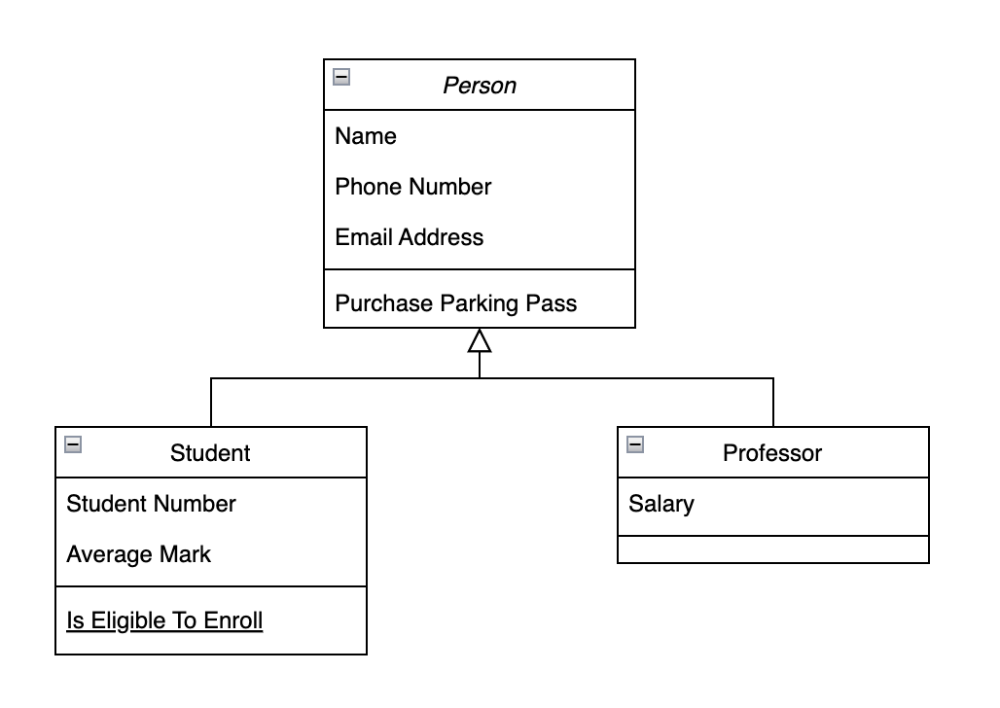
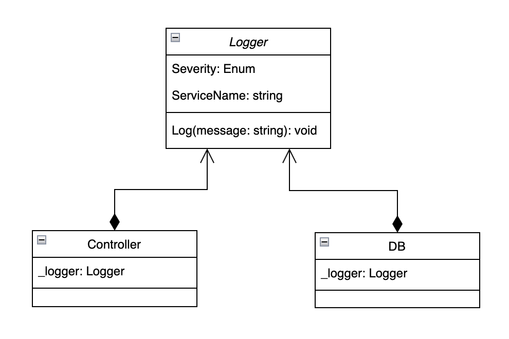

# C# Intermediate

- [Application](#application)
- [Class](#class)
  - [Anatomy Of Classes](#anatomy-of-classes)
  - [Instantiating A Class](#creating-an-object-of-instantiating-a-class)
  - [Object Method VS Static Method](#object-method-vs-static-method)
  - [Constructor](#constructor)
  - [Method Overloading](#method-overloading)
  - [Object Initialization](#object-initialization)
- [Defensive Programming](#defensive-programming)
  - [Error Handling](#error-handling)
- [Method Parameter Modifiers](#method-parameter-modifiers)
  - [Params Modifier](#params-modifier)
  - [Out Modifier](#out-modifier)
  - [Ref Modifier](#ref-modifier)
  - [In Modifier](#in-modifier)
- [Fields](#fields)
  - [Readonly](#readonly)
- [Access Modifiers](#access-modifiers)
- [Properties](#properties)
- [Indexer](#indexer)
  - [Dictionary](#dictionary)
  - [Indexer Class](#indexer-class)
- [Association Between Classes](#association-between-classes)
- [Polymorphism](#polymorphism)
  - [Upcasting And Down Casting](#upcasting-and-down-casting)
  - [Boxing And Unboxing](#boxing-and-unboxing)
  - [Method Overriding](#method-overriding)

<a id='application'></a>
## Application 

1. Presentation (frontend)
2. Business Logic / Domain
3. Data Access / Persistence

<a id='class'></a>
## Class 

- A building block of a software application
- Naming convention: PascalCase
- Declaration: `<access-modifier> class <identifier> {}`
  - Example: `public class Person {}`

<a id='anatomy-of-classes'></a>
### Anatomy Of Classes 
1. Data or Fields 
2. Behaviour or Methods

- Fields declaration: `<access-modifier> <type> <identifier>;`
  - Example: `public string name;`
- Method declaration: `<access-modifier> <return-type> <identifier>(<arguments>) {}`
  - Example: `public string setName() {}`
- Fields and methods naming convention: PascalCase
- Note: if return is empty (no return) then the return type of method should be set to void.

<a id='creating-an-object-of-instantiating-a-class'></a>
### Creating An Object of (Instantiating) A Class

- Syntax 1: `<class-name> <object-name> = new <constructor> (<arguments>);`
  - Example: `FileInfo file = FileInfo();`
- Syntax 2: `var <object-name> = new <constructor> (<arguments>);`
  - Example: `var file = FileInfo();`

<a id='object-method-vs-static-method'></a>
### Object Method VS Static Method

- Object (instance) method is accessible through only an instance of a class
- Static methods and fields belong to class itself. They cannot be accessed through instances.
- We use static for concepts that are singleton. There should be only one instance of it in memory.
- Object method example: 

    ```
    var file = FileInfo();
    file.Copy(args)
    ```
- Static method example: `File.Copy(args)`;
- Declare a static field example: `public static int universeAge = 13.8;`
- Use static keyword to declare a static method.
- Use static method to create an object of the same class or its parent class

<a id='constructor'></a>
### Constructor

- It's a method that is called when an instance of a class is about to be created
- Example: `FileInfo()` is the constructor of the class FileInfo: `ver file = FileInfo();`
- Constructor has the same name as the class. It's PascalCase
- Constructor does not have a return type (not even void)
- Constructor sets the fields values. If a field is not mentioned, it will be set to its zero value
- Example:

    ```
    public class Person {
        public string name;
        public int age;
        public int height;
        public Person(string name) {
            this.name = name;
            this.height = 40;
        }
    }
    // inside the Main: 
    var person = new Person("Jane");
    ```
  - `this` keyword refers to the object. 
  - age is set to zero when constructor is called by default
  - height is set to 40 in the constructor
- If a constructor is not provided, C# assumes a default constructor where all fields would set to their zero values.
- If any constructor overload is defined, C# compiler would not consider any default constructor anymore.

<a id='method-overloading'></a>
### Method Overloading
- Method signature: a method signature is combination of its name, number and type of its arguments
- You can use the same method name but change any other factor of its signature. 
- When calling the method, only the overload that matches the signature would be called
- Example:

    ```
    public class Person {
        public string name;
        public int age;
        public int height;
        public int id;
        public Person() {
            this.id = 5; // you should normally generate a unique id
        }
        public Person(string name) : this() {
            this.name = name;
            this.height = 40;
        }
        Public Person(string name, int age, int height) : this(name) {
            this.height = height;
            this.age = age;
        }
    }
    // inside the Main: 
    var person1 = new Person("Jane");
    var person2 = new Person("John", 23, 180);
    ```
  - person1 calls the second constructor overload and person2 calls the third one.
  - You cannot have two overloads with the exact same signature.
  - `this()` is delegating a proper constructor overload (calling it before running its own body) that takes no parameter.
  - `this(name)` is delegating a constructor that takes the "name" arg as input
  - Constructor best practice:
    - If possible: Define a constructor with minimum required args and add other args with default value
    - Avoid creating overloads for different input combinations

<a id='object-initialization'></a>
### Object Initialization

- Example: `var person = new Person { name = "Jane", age = "35"};`
- Object initialization syntax would first call the default constructor and then assign the specified fields.
- It is equivalent to:
  ```
  var person = new Person();
  person.name = "Jane";
  person.age = 35;
  ```

<a id='defensive-programming'></a>
## Defensive Programming 
- Defensive programming is a good practice as it allows you to quickly react to any unexpected situations
- It is both a philosophy and a collection of techniques that can be used to allow a project to reach the finish line, even if you encounter a few unexpected turns in the road.

<a id='error-handling'></a>
### Error Handling
- Check for edge cases and handle the possible errors
- Example: what would happen if a null object is passed to the method Move()?
  ```
  public class Point
  {
    public int X;
    public int Y;
  
    public Point(int x, int y)
    {
      this.X = x;
      this.Y = y;
    }
  
    public void Move(Point newLocation)
    {
      this.X = newLocation.X;
      this.Y = newLoacation.Y;
    }
  }
  ```
- Answer: it would throw `System.NullReferenceException` and application would crash.
- Solution: check for null argument and throw exception to the caller
  ```
  public void Move(Point newLocation)
  {
    if(newLocation == null)
      throw new ArgumentNullException("newLocation);
    this.X = newLocation.X;
    this.Y = newLocation.Y;
  }
  
  // in the caller function
  Point point = null; // mocking any calculation that can result in null object
  var secondPoint = Point(10, 20);
  try {
    secondPoint.Move(point);
  }
  catch (Exception) {
    // you can log the exception here
    secondPoint.Move(new Point(0, 0)); // depending on your logic for handling the error
  }
  ```
  - Logging the error in catch is recommended.
  - ArgumentNullException is a class in System namespace. Its argument is the parameter name which becomes null.
  - If ArgumentNullException is not handled it will still throw an error and crashes the application.
  - try / catch is an error handling mechanism. 
  - The `Exception` parameter in `catch` can be narrowed down to `ArgumentNullException`.
  - More on exception handling in the advanced section.
- Defensive programming improves the robustness of the code.

<a id='method-parameter-modifiers'></a>
## Method Parameter Modifiers
<a id='params-modifier'></a>
### Params Modifier
- To pass an arbitrary number of arguments of the same type to a method
- Example:
  ```
  public class Clculator {
    public static int Add(params int[] numbers) 
    {
      var sum = 0;
      foreach (var number in numbers)
      {
        sum += number;
      }
      return sum;
    }
  }
  // in the caller function:
  var sum1 = Calculator.Add(1, 2, 3);
  var sum2 = Calculator.Add(new int[] {1, 2, 3, 4, 5, 6, 7});
  ```
- Only the last parameter of a method can have `params` modifier.
- Example:
  ```
  public int Add(string message, params int[] numbers)
  {
    Console.WriteLine(message);
    var sum = 0;
    foreach (var number in numbers)
    {
      sum += number;
    }
    return sum;
  }
  ```

<a id='out-modifier'></a> 
### Out Modifier
- A method can take a (reference of a ) parameter and assign some value to it.
- The passed argument should not be initialized in the caller method. It must be initialized inside the method that accepts it as parameter.
- Example: to check if a string can be parsed to int
  ```
  var number; // it is declared but not initialized
  var numberFromPayload = "12a";
  if (!int.TryParse(numberFromPayload, out number) 
  {
    throw new FormatException();
  }
  ```
  - The return of the `TryParse()` method is a boolean that represents a successful conversion.
  - It is also possible to use `int.Parse()` method and wrap it in `try / catch`.
  - To define a method with `out` modifier:
  ```
  public boolean GetCacheValue (string key, out value) 
  {
    // logic goes here
  }
  ```
- Both caller and method definition must use the `out` keyword explicitly.
- The out parameters are not allowed to be used in asynchronous methods.
- The out parameters are not allowed to be used in iterator methods.
- There can be more than one out parameter in a method.
- Method overloading can also be done using out parameters.
- Properties cannot be passed as out parameters since they are not variables.
- From C# 7.0, at the time of method call, out parameter can be declared inline. But the inline out parameters can be accessed in the same block of code where it calls.
  ```
  var doesExist = GetCacheValue (cacheKey, out string cacheValue);
  ```

<a id='ref-modifier'></a>
### Ref Modifier
- Ref modifier (`ref`) allows to pass an argument to a method by its reference.
- It is similar to out modifier, except that the parameter should be initialized in the caller method.
- Value of the passed variable can be modified inside the method.
- The ref keyword cannot pass a property
- Note: class objects are passed by reference by default.

<a id='in-modifier'></a>
### In Modifier
- Pass an argument by reference and as a constant. Parameter passed as `in` cannot be modified.
- The `in` keyword must be used in parameter, but it is optional to be used in the argument.
- Variables passed as in arguments must be initialized before being passed in a method call.
- The in parameter modifier is available in C# 7.2 and later. Previous versions generate compiler error CS8107.
- Methods cannot be overloaded if the only difference is that one method takes a ref or out argument and the other takes an in argument.

<a id='fields'></a>
## Fields
- There are two practices to initialize fields that do not get any value from the constructor:
  1. Have a default constructor to initialize all your fields that do not accept values from the constructor in the default constructor and use delegation in other constructors
  2. Initialize those fields where declaring them outside the constructor (in the class body).
  - The second approach seems cleaner. Whichever approach that you choose, make it consistent throughout your application.

<a id='readonly'></a>
### Readonly
- Use `readonly` keyword when declaring a field to make sure it never gets reassigned.
- It can help not to lose the value of a variable after first initialization.
- Initialization can only happen at the declaration or in the constructor.
- Example: `public readonly List<Order> cart = new List<Order>();`
  - You potentially do not want to lose the items added to the cart at different part of the application.
  - Items can be added or removed from cart but the cart itself cannot be reassigned.

<a id='access-modifiers'></a>
## Access Modifiers
- Access modifiers help with encapsulation (information hiding).
- Access modifiers define the level of access of a class and its methods and fields.
1. Public: can be accessed from anywhere (other classes)
2. Private: can be accessed inside the host class only. A class can be private if it is nested inside another class.
3. Protected: will be explained later
4. Internal: will be explained later
5. Protected Internal: will be explained later
- If there is any use case to access or modify a private field from outside, there can be public getter and setter methods.
- Setter method receives an input parameter that should be validated before being assigned to the private field
- A convention: private fields should be _camelCase starting with an underscore.
- In OOP fields are private concepts, and they should be accessed through public methods.

<a id='properties'></a>
## Properties
- Property is a class member that encapsulates a getter/setter for accessing a field.
- Reason to use a property: to create getters and setters with less code.
- Properties are declared public. Compiler creates private fields internally for each property.
- Properties can have getter and setter to provide access to the private fields' values.
- How it is written traditionally:
  ```
  public class Person
  {
    private DateTime _birthdate;
  
    private void SetBirthdate(DateTime birthdate)
    {
      this._birthdate = birthdate;
    }
    
    public DateTime GetBirthdate()
    {
      return _birthdate;
    }
  }
  ```
- How to use auto-implemented properties instead:
  ```
  public class Person
  {
    public DateTime Birthdate { get; private set; }
  }
  // in the caller function:
  var person = Person();
  person.Birthdate = DateTime.Now; // error: it cannot be set from outside the class
  ```
- How it looks like internally when using properties:
  ```
  public class Person
  {
    private DateTime _birthdate;

    public DateTime Birthdate
    {
      get { return _birthdate; }
      private set { _birthdate = value; }
    }
  } 
  ```
- Best practice: order of properties and methods:
  1. Auto-implemented properties
  2. Constructor(s)
  3. Properties with getter / setter body
  4. rest of the class (methods, etc)

- Example:
  ```
  public class Person
  {
    public DateTime Birthdate { get; private set; } // auto-implemented property
    public string Name { get; set; }
  
    public Person(DateTime birthdate, string name)
    {
      Name = name;
      Birthdate = birthdate;
    }
  
    public int Age // no setter, it should be calculated based on Birthdate
    {
      get
      {
        var ageTimeSpan = DateTime.Today - Birthdate;
        return ageTimeSpan.Days/365;
      {
    }
  }
  ```

<a id='indexer'></a>
## Indexer
- Indexer is a class that can be used as dictionary
- Use case: adding custom function to dictionary. Such as expiry for a key.

<a id='dictionary'></a>
### Dictionary
- It maps a key of any type to a value of any type
- It provides access to a value in constant time given its corresponding key.
- Arrays provide access by index, dictionaries provide access by key.
- Declaration example: `var cache = new Dictionary<string, string>();`
- Dictionary has generic type
- It is in `System.Collections.Generic` namespace.
- To set a key/value pair: `cache[key] = value`
- To get the value of a key: `cache.GetValue(key)`
- The `GetValue()` method raise an exception if key does not exist
- To get the value if key exists: `cache.TryGetValue(key, out string value);`
- The `TryGetValue()` returns a boolean that indicates if the key existed.

<a id='indexer-class'></a>
### Indexer Class
- Indexer can extend the dictionary function for a particular purpose.
- Example:
  ```
  public class Cookie
  {
    private readonly Dictionary<string, string> _dictionary;
    public DateTime Expirey { get; private set; }
    
    public Cookie() 
    {
      _dictionary = new Dictionary<string, string>();
    }
  
    public string this[string key] // indexer property 
    {
      get 
      { 
         if (_dictionary.TryGetValue(key, out tring value))
             return value;
         // throw exception or return null here
      }
      set { _dictionary[key] = value; }
    }
  // logic for expiry, etc here
  }
  ```

<a id='association-between-classes'></a>
## Association Between Classes

<a id='class-coupling'></a>
### Class Coupling

<a id='tightly-coupled'></a>
#### Tightly Coupled
- Classes are dependent to each other throughout the application
- Changing one class requires making changes in all its dependent classes.
- It can cause a chain of changes.

<a id='loosely-coupled'></a>
#### Loosely Coupled
- An ideal application
- Changing a class is isolated
- To design a loose coupling application, three concepts should be considered.
  1. Encapsulation (information hiding): already covered
  2. The relationship between classes: will be covered here
  3. Interfaces: will be discussed later

<a id='classes-relationships'></a>
### Classes Relationships
1. Inheritance
2. Composition
- Composition relationships usually result in less coupling.

<a id='inheritance'></a>
## Inheritance
- Parent-child relationship between classes.
- Child can reuse codes of parents (inherit code from parent).
- Also known as **Is-A** relationship. A car (child) is a vehicle (parent).
- In C#, a class can have only one parent.
- Benefits:
  1. Code reuse
  2. Encapsulation
  3. Polymorphic behaviour
- You should call the constructor of the parent (base) class in the constructor of its children.
- Constructor of the base class is always executed first.
- If base() is not called, the default parent constructor will be called. If parent class has no default (parameterless) constructor, compiler would complain.
- Example:
  ```
  public class Person
  {
    private string _id;
  
    public Person(string id)
    {
      _id = id;
    }
  }
  
  public class Student : Person
  {
    public string Name;
  
    public Student(string id, string name) : base(id)
    {
      Name = name;
    }
  }
  ```

- UML Representation 
  - Person is the parent (base or super) class and Student and Professor are its two children (derived or subclasses) classes.

    

<a id='composition'></a>
## Composition
- Composition allows a class contains other classes
- It is also known as **Has-A** relationship. A car has an engine.
- Benefits:
  1. Code reuse
  2. Flexibility
  3. A means to loose-coupling
- Example: create a logger class and add it as a private field in any class
- UML Representation

  

<a id='more-on-access-modifiers'></a>
## More On Access Modifiers

<a id='protected'></a>
### Protected
- A protected field, method, or class is only accessible through the class itself or its children.
- Protected modifier breaks encapsulation. Try to avoid it as much as possible.
- A class can be protected only if it is nested inside another class

<a id='internal'></a>
### Internal
- An internal class, field, or method is accessible in all classes of current assembly.
- It makes sense to use internal instead of public in many cases

<a id='protected-internal'></a>
### Protected Internal
- A protected internal class, field, or method is accessible through same assembly or the children of the class
- A class can be protected internal if it is nested inside another class.

<a id='polymorphism'></a>
## Polymorphism

<a id='upcasting-and-down-casting'></a>
### Upcasting And Down casting
- Works because of inheritance.
- Upcasting happens if we assign an object of a child class to a variable of a parent class.
- Upcasting is implicit since parent class data and behaviour is included in the child object.
- Example of upcasting:
  ```
  public class Triangle: Shape
  {}
  
  // in the Main method: 
  Shape shape = new Triangle();
  ```
- Note: In the example above, only Shape methods are available to the shape variable. 
- Note: By down casting shape to Triangle type, shape object will get access to Triangle methods and properties.
- Down casting happens if we explicitly cast an object of a parent type to a child class type.
- Down casting is only possible if the underlying type of the parent object is actually the child class type.
- Example of down casting:
  ```
  var triangle = (Triangle)shape;
  ```
- If the underlying type of the shape is not Triangle, down casting it to Triangle would throw `InvalidCastException`.
- Three ways to make sure we won't get the `InvalidCastException`:
  1. Use try / catch
  2. Use `as` keyword. It will return null if the underlying type mismatched the child class.
     
     Example: if `shape` is not `Triangle` then `triangle` would be `null`
     ```
     var triangle = shape as Triangle;
     if (triangle != null)
     {...}
     ```
  3. Use `is` for checking if type an object is a specified class: 
    
     Example: 
     ```
     if (shape is Triangle)
     {...}
     ```
<a id='boxing-and-unboxing'></a>
### Boxing And Unboxing
- Boxing: the process of converting a value typed instance to an object reference.
- Example: `object num = 18;`
- The value in boxing gets boxed and stored in the heap instead of stack.
- Unboxing is the opposite of boxing.
- Example: `int number = (int)num;`
- Note: boxing and unboxing have extra performance penalty because of object creation.
- Example: 
  ```
  var arrList = new ArrayList();
  arrList.Add(21);
  arrList.Add("years");
  arrList.Add(DateTime.Today);
  ```
- In the example above, the integer 21 and `DateTime` structure are value types. The input of the Add method is an object. Hence, boxing happens for the first and third add.
- Second issue. `ArrayList` compromises type safety.
- Solution: use generic list. Add method received an integer instead of an object. It helps with type safety and no boxing.
  ```
  var list = new List<int>();
  lust.Add(21);
  ```

<a id='method-overriding'></a>
### Method Overriding
- Overriding: Modifying the implementation of the inherited method.
- Parent class must allow its method to be overridden by its children classes -> Use `virtual` keyword.
- Child class should specify the method is being overridden -> Use `override` keyword.
- If not overridden, the default parent implementation of the method would be inherited.
- Polymorphism example:
  ```
  public class Shape {
    public virtual void Draw() {
      Console.WriteLine("Inside Shape.Draw()");
    }
  }
  
  public class Circle: Shape {
    public override void Draw() {
      Console.WriteLine("Inside Circle.Draw()");
    }
  }
  
  public class Triangle: Shape {
    public override void Draw() {
      Console.WriteLine("Inside Triangle.Draw()");
    }
  }
  
  // inside main:
  var shapes = new List<Shape>();
  shapes.Add(new Circle());
  shapes.Add(new Triangle());
  foreach(var shape in shapes)
  {
    shape.Draw();
  }
  ```
  Console output:
  ```
    Inside Circle.Draw()
    Inside Triangle.Draw()
  ```
