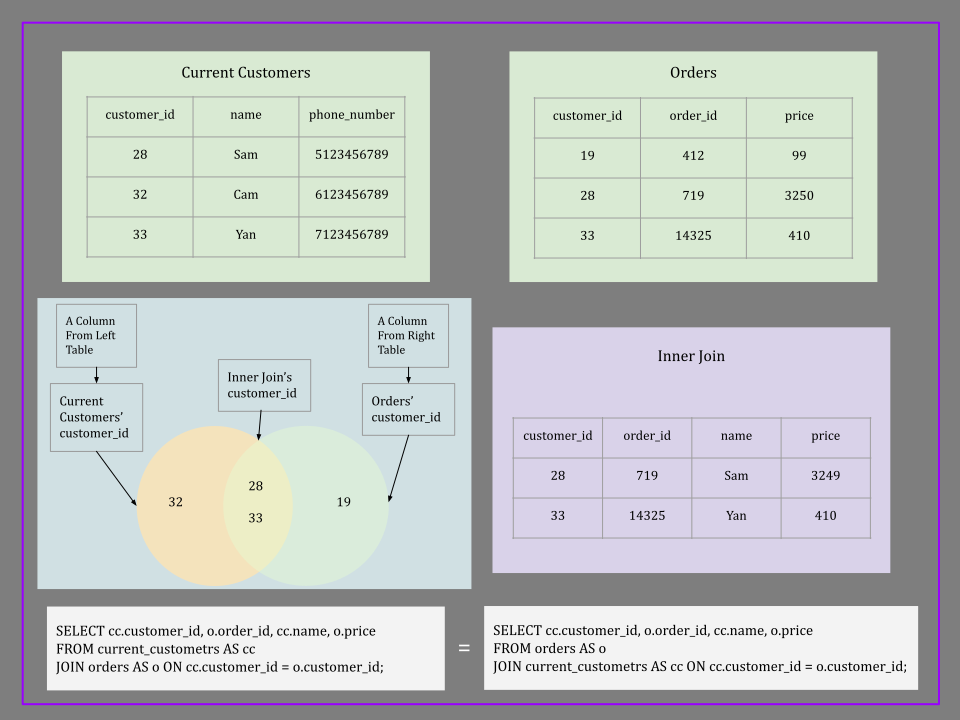
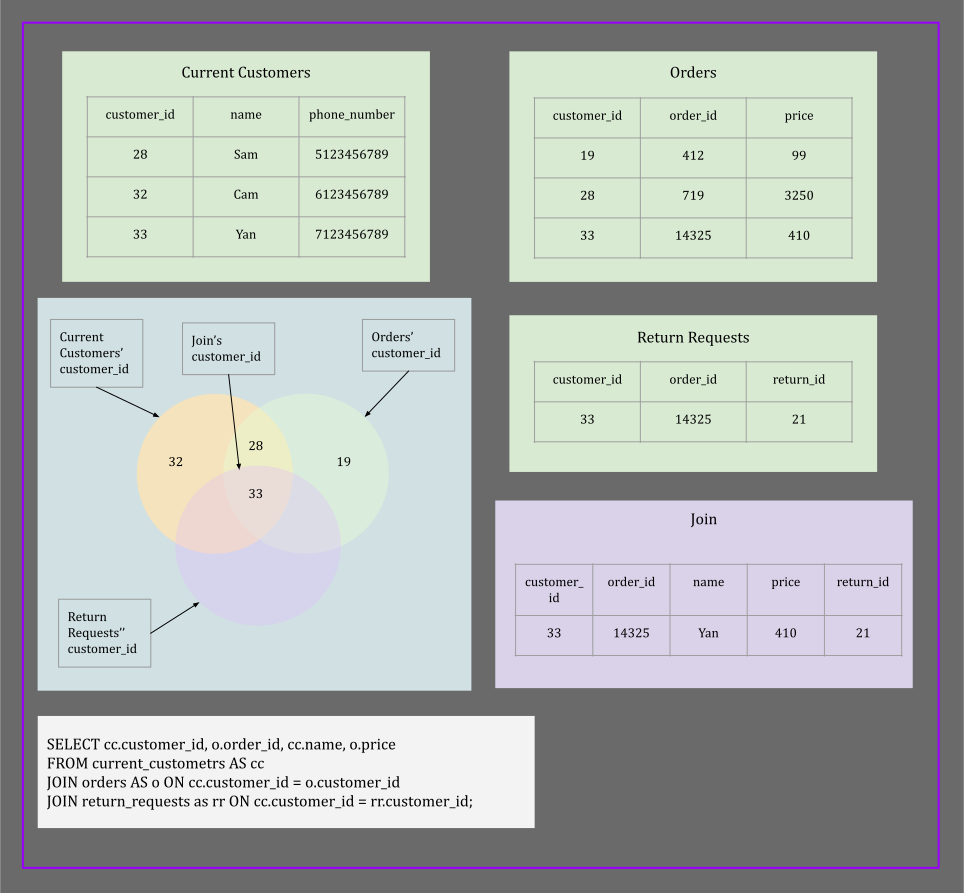

# SQL 
- [Introduction](#introduction)
  - [Database](#database)
    - [Definition](#definition)
    - [DBMS](#db-management-system)
    - [Types of databases](#types-of-databases)
    - [RDBMS](#rdbms)
    - [Sample Query](#sample-query)
  - [Declarative VS Imperative](#declarative-vs-imperative)
    - [Declarative Language](#declarative-language)
    - [Imperative Language](#imperative-language)
  - [SQL VS Sequel](#sql-vs-sequel)
    - [SEQUEL](#sequel-naming)
    - [SQL](#sql-naming)
- [History Of Database](#history-of-database)
  - [File Processing Systems](#file-processing-systems)
  - [Database Models](#database-models)
    - [Hierarchical Model](#hierarchical-model)
    - [Networking Model](#hierarchical-model)
    - [Relational Model](#hierarchical-model)
- [DBMS](#database-management-system)
  - [CRUD](#crud)
    - [Create](#create)
    - [Read](#read)
    - [Update](#update)
    - [Delete](#delete)

<a id="introduction"></a>
## Introduction

<a id="database"></a>
### Database

<a id="definition"></a>
#### Definition 
- A system made of hardware to store and process data, and software to access and manage data

<a id="db-management-system"></a>
#### DBMS
- Short for database management system. 
- A software that manages databases by storing and manipulating data in a hardware.

<a id="types-of-databases"></a>
#### Types of databases
1. Relational
   - MS SQL, MySQL, Postgres, etc. 
   - It supports ACID transactions.
   - It is made of tables (rows and columns).
2. Document
   - MongoDB, CouchDM, Fire Base.
   - Data is in big documents that contains related documents.
3. Key-Value
   - DynamoDB, Redis
   - Fast
   - A candidate for caching data
5. Graph
   - Neo4j, AWS Neptune.
   - Suitable if data are connected in different ways.
   - Such as social network data.
6. Wide Columnar
   - Pioneered by Google’s big table databases like Apache Cassandra.

<a id="rdbms"></a>
#### RDBMS
- Short for relational database management system.
- A DBMS that is specified for relational databases
- SQL is an RDBMS programming language that stores and retrieves data.
- SQL Online Playground: [db-fiddle.com](https://www.db-fiddle.com/)
- Each row is a separate entity called a record.
- Each column is a specific feature of an entity. For example: age, address, name.
- Example of a table named **Employees** in a relational database:

| firstname | lastname | age |
|:---------:|:--------:|:---:|
|   John    |  Smith   | 28  |
|   Jane    |  Smith   | 26  |
|   John    |   Doe    | 31  |

<a id="sample-query"></a>
#### Sample Query
- Query is also known as SQL statement
- Syntax: `SELECT <column-name> FROM <table-name>;`
- Example: `SELECT firstname from Employees;`
- The words `SELECT` and `FROM` are SQL reserved keywords.
- SQL keywords are case-insensitive.
- Example: `select firstname from Employees;`
- Note: Using uppercase for SQL reserved keywords is a better practice. It makes statements more readable.
- Column and table names are also case-insensitive as long as it is not wrapped in double quotes
- Example: `SELECT firstname from Employees;`
- Example: `SELECT Firstname from EMPLOYEES;`
- Example: `SELECT "firstname" from "Employees";`
- Query statement does not necessarily end at the end of a line
  - A query ends where SQL sees a semicolon.

<a id="declarative-vs-imperative"></a>
### Declarative VS Imperative

<a id="declarative-language"></a>
#### Declarative Language
- User specifies **what** should happen
- How it's happening is not obvious
- SQL is a declarative language

<a id="imperative-language"></a>
#### Imperative Language
- User must specify how exactly something should happen
- Example: Java

<a id="sql-vs-sequel"></a>
### SQL VS SEQUEL

<a id="sequel"></a>
#### SEQUEL 
- The original name for SQL language
- Short for **Structured English Query Language**
- It had to be changed because of copyright conflict

<a id="sql-naming"></a>
#### SQL
- Is the true, official, and current name of this language
- Short for **Structured Query Language**
- It is made by IBM scientists in the 1970s.
- SQL is a standardized language.


<a id="history-of-database"></a>
## History Of Database

<a id="file-processing-systems"></a>
### File Processing Systems
- It was similar to keeping files in a cabinet
- No correlation (=relationship) between files
- It was not possible for different system to communicate with each other. Hence, data had to be copied into different systems.

<a id="database-models"></a>
### Database Models

<a id="hierarchical-model"></a>
#### Hierarchical Model
- Old and deprecated
- Primarily used by IBM in the 60s and 70s.
- It is not an efficient model for storing data
- It has a tree-like structure
- Each parent node can have multiple children
- A child node can only have one parent (a single root)
- It is a one-to-many relationship
- It is similar to XML structure:
- XML example:
    ```
    <Authur>
        <Marquez>
          <Country>Colombia</Country>
          <Book>100 Years of Solitude</Book>
        </Marquez>
        <JKR>
          <Country>UK</Country>
          <Book>Harry Potter</Book>
        </JKR>
    </Authur>
    ```
- Deleting a parent would delete all its children information as well.
- Hierarchical model example:


<a id="networking-model"></a>
#### Networking Model
- Old and deprecated
- Fixes the lack of many-to-many relationships between nodes.
- Example: if multiple authors contribute in writing a book.
- If a parent gets deleted, all its children would be removed as well.
- Conclusion: the tree like structure does not provide a general model for storing data.
- One solution: relational model

<a id="relational-model"></a>
#### Relational Model
- Have one table to store information about authors
- Have one table to store information about books
- Link the two tables with primary keys and foreign keys
- Example:


- To build the many-to-many relationship between books and authors:
  - Remove the `author_id` column from the `Book` table.
  - Create another table that maps author ids to book ids.
- Primary key: is a column with unique values in a table. It is referred as `id` in the example above.
- Foreign key: is another table's primary key. It is used to build relationship between tables.

<a id="database-management-system"></a>
## Database Management System (DBMS)

<a id="crud"></a>
### CRUD

<a id="create"></a>
#### Create
- Create databases, tables, and add data

<a id="read"></a>
#### Read
- Read data from database

<a id="update"></a>
#### Update
- Change and update existing data

<a id="delete"></a>
#### Delete
- Delete data, tables and databases


### What DBMS Does
#### Manage Data
- Manage data, store, and retrieve them.
#### Secure Data
- Define roles and permissions. Who can access for what operation on data.
#### Transaction Management
- Handle async processes

### MS SQL vs Oracle vs MySQL
- They all use SQL as common language in their DBMS
- They interact with data slightly different, handle hard drive differently, etc.
- Each has its own variation of SQL that can implement some extra features to compete with others.

### Codd's Rules
- Rules that define a database to be the correct RDBMS
- Codd presents his 13 rules for a database to test the concept of DBMS
  against his relational model, and if a database follows the rule, it is called a true relational database (RDBMS).
- Google `13 Rules of Codd`

### Relational Model

#### Terms
- A table is made of rows and columns
- Each table has a name
- Each column is a specific type of data. For example: date, number, string, etc.
- Each row is a specific entity. 
- Columns are defined when a table is being created
- Rows are the data we feed to the table
- Degree: the collection of all the columns in a table
- Attributes: similar to degree. Each attribute (or column) is a specific feature of data
- Domain/Constraint: is the type of data that is allowed in a column.
- Tuple/Record: is a single row of data. It is one record. It is an entity broken down to columns as a tuple.
- Cardinality: a collection of rows/tuples in a table


#### Primary Key
- Unique identifier for each row. 
- PK should not be nullable

#### Foreign Key
- PK of a table is a foreign to other tables
- FK is not necessarily unique
- FK is a way to reference data from one table to another.
- Multiple rows of a table can be associated to the same row of another table
- Using the PK of table `T1` as FK in `T2`, each one row of `T1` can be related to many rows of `T2` (one-to-many relationship)
- Example: One author might write multiple books. All those books in the `Book` table have the same `AuthorId` as foreign key

### OLTP vs OLAP
- They logically differ by their use case.
#### OLTP
- Short for **Online Transaction Processing**
- Databases that drive day to day transactions
- Example: in Amazon: databases that are used for manage customers data, orders data, transactions data, etc.

#### OLAP
- Short for **Online Analytical Processing**
- Put data in data warehouse and use it to analyze data.
- OLAP databases are created by data that captured and stored in OLTP databases.
- Use case: find what is valuable about data. 

#### Exercise
- Which one is OLTP vs OLAP?
  1. A database that logs customers and orders
  2. A database being used to figure out what new products should be offered
  3. A database to drive statistics to be reported to executives
  4. A database to keep track of users
- Answer: Transactional database-Analytical database-Analytical database-Transactional database
- Losing an OLTP database has direct effect in day to day transactions
- Losing an OLTP database can also affect the ability of creating OLAP databases and analyzing capabilities
- Example: losing a customer database interrupts day to day transactions
- Example: losing a database that keeps tracking on users interrupts the analytical capabilities about the users behaviour
- A database that keeps data for tracked users can be used to build OLAP databases.

## PostgreSQL
### Postgres Docker Container
- Run the following command:

    `sudo docker container run -p 5432:5432 --name postgres -d -e POSTGRES_PASSWORD=password --restart always postgres`
- Set the password to something more secure

### Installed On Ubuntu
- To run postgres commands: `sudo -u postgres psql postgres`
- To see the list of databases: `\l+`
- Set password for the user "**postgres**": `\password postgres`

## SQL Commands

### SQL Command Categories
#### DCL
- Short for data control language
- Used for granting and revoking access
#### DDL
- Short for data definition language
- Setting up databases and tables
- Used for:
  - Create
  - Alter
  - Drop
  - Rename
  - Truncate
  - Comment
#### DQL
- Short for data query language
- It contains the `SELECT` statement

#### DML
- Short for data modification language
- Make changes to databases, tables, and data
- Used for:
  - Insert
  - Update
  - Delete
  - Merge
  - Call
  - Explain Plan
  - Lock Table

### SQL SELECT
- Used for query and retrieve data
- Base syntax: `SELECT <column-name> AS <column-alias> FROM <table-name> AS <table-alias>;`
- Separate multiple column identifiers by comma
- Use astrix (`*`) to select all columns.
- Example: `SELECT firstname AS name, phone_number AS contact FROM current_customers AS clients;`
#### CONCAT
- It concatenates two or more columns and name the result column as `concat`
- Example: `SELECT CONCAT(firstname, ' ', lastname) as "full name" FROM person;`
- Note: Use single quotes for strings in data
- Note: Use double quotes for column and table names and aliasing
- A function like `CONCAT` will put its name ('concat') as column name by default unless an alias is specified

#### Functions:
- Aggregate functions: run on all selected rows and return a single value
  - Example: `SUM`, `AVG`, `COUNT`, `MIN`, `MAX`, `LENGTH`
- Scalar functions: run on given columns separately on each row and return a single column
  - Example: `CONCAT`, `COALESCE`
- Note: Setting aliases and applying function do not modify the original table. It just applies to the retrieved data.

#### Comment
- Single line comment: `-- the rest of the line after two dashes`
- Multiline comment: `/* all the lines betwee these two signs */`
- Add comments to complex queries

#### Filtering Data
- Use `WHERE` clause to add condition to the query.
- Example: limit the retrieved data to specific age range, range of salaries, person name, etc.
- Example: `SELECT firstname FROM person WHERE age >= 18`
- Conditions: >= > = < <= != <> LIKE ILIKE IN ...
- Note: Check equality with single `=` instead of double `==`
- Note: comparing strings: `a` < `b` => true
- Note: comparing strings: `a` < `A` => true
- Note: comparing strings: `A` < `b` => true
- Example: `abc` > `ace` => false
- Note: `a` < `A` < `b` < `B` ...
- Question: true or false? `SELECT 'ab' < 'A'`
- Note: `a` < `A` < `aA` < `Aa`
- Note: `a` < `ab` < `abc` < `b`

#### Multiple Conditions
- To apply multiple filters, we can use `AND`, `OR`, and `NOT` keywords.
- Operator Precedence: `(parentheses)` > `* /` > `+ -` > `NOT` > `AND` > `OR`
- More details: (parentheses) > arithmetic operators > concatenation Operators > comparison conditions > `IS NULL`, `LIKE`, `NOT IN`, etc > `NOT` > `AND` > `OR`
- For the same operators, precedence is left to right for most operands and right to left for others
- Right to left operands: unary plus, unary minus, `NOT`.

#### NULL Values
- In SQL NULL means **anything**
- Following are a few examples of the three-values logic:
- `NULL OR true` => `true`
- `NULL OR false` => `NULL`
- `NULL AND true` => `NULL`
- `NULL AND false` => `false`
- Null is not equal to null:
- `NULL = NULL` => `NULL`
- `NULL != NULL` => `NULL`
- `Null = 'some value' => NULL`
- `Null != 'some value' => NULL`
- NULL is software debt. It makes programs to crash or make mistake
- It is possible to constraint a column to be not nullable.
- Always check for NULL values for nullable entities
- To check for `NULL` value, the `IS` keyword must be used.

#### IS
- Use to check for `NULL`
- Syntax: `SELECT * FROM <table> WHERE <column> IS [NOT] NULL;`
- Other use cases: `SELECT * FROM employees WHERE gender = 'M' IS false;`

#### COALESCE
- Use as `NULL` value substitution
- Syntax `SELECT COALESCE(<column>, 'Empty') AS "<alias>" FROM <table>;`
- Note: 'Empty' is the fallback value. If column value is `NULL`, it would fall back to 'Empty'.
- Multiple columns: `COALESCE(<col1>, <col2>, <col3>, 'Empty') AS <alias>`
- Example: `SELECT coalesce(firstname, lastname, 'None') AS "name" from person;`

#### BETWEEN AND
- Use case: to filter based on a range
- Note: the range is **inclusive**
- Example: `SELECT * FROM customers WHERE age BETWEEN 18 AND 65;`
- Equivalent: `SELECT * FROM customers WHERE age >= 18 AND age <= 65;`

#### IN
- To filter based on items in an array
- The `IN` keyword avoids writing many equal and `AND` conditions.
- Example: `SELECT * FROM orders WHERE country IN ('us', 'ca')`

#### LIKE
- Use case: query based on a pattern in records of a column.
- `LIKE` is equivalent to `~~`
- `NOT LIKE` is equivalent to `!~~`
- On Postgres, the type of column must be text (string) in order to be able to use `LIKE` on it. 
- Example: `SELECT name FROM person WHERE name LIKE 'J%';` => All names that start with the letter 'J'.
- Use regular expression (wildcards) to build the pattern
  - For zero or more characters: `%`
  - For exactly one character: `_`
  - Any single character specified in brackets: `[adg]`
  - Any single character not specified in brackets: `[^ot]` or `[!ot]`
  - Any single character within a range (inclusive): `-`
  - One or more character of choice: `([1-9]+)`
- Example: `[0-9]` => any number between 0 and 9
- Example: `h[^ao]t` => may return 'hit' but not 'hat' or 'hot'
- Example: `_%@_%.com` => an email address with `.com` domain
- To make the pattern matching case-insensitive: use `ILIKE` instead of `LIKE`.
- `ILIKE` is equivalent to `~~*`
- `NOT ILIKE` is equivalent to `!~~*`
- In order to use `LIKE` for non-text columns, they should be cast to text.

#### CAST Function
- Syntax: `CAST(<column> as text)`
- Shorthand syntax: `<column>::text`
- `SELECT * FROM person WHERE birth_date::text LIKE '1990%';`

#### Timezone
- GMT is short for Greenwich Mean Time.
- GMT is not a standard, it is a timezone.
- UTC is short for Universal Time Coordinate
- UTC is not a timezone, it is a standard
- Greenwich is the reference point in timezone in UTC standard
- UTC and GMT share the same current time
- It is recommended to use UTC as standard
- To set UTC only for the current session: `SET TIME ZONE 'UTC';`
- Set timezone for all next sessions for the current user: `ALTER USER <postgres> SET timezone='UTC';`

#### Format Date And Time
- A format is a way of representing a date and time.
- Postgres uses ISO-8601. This is standard about formatting date and time.
- ISO-8601: `YYYY-MM-DDTHH:MM:SS`
- Example: `2022-06-21T11:18:07+02:00`
- Note: The `+02:00` is the timezone.

#### Timestamp
- Is a type of data that a column can be constraint to.
- Example `INSERT INTO timezones VALUES (TIMESTAMP WITHOUT TIME ZONE '2022-06-21T11:18:07-05', TIMESTAMP WITH TIME ZONE '2022-06-21T11:18:07-05');`

#### Date Functions
- Get current date:
  - Method one: `SELECT now()::date;`
  - Method two: `SELECT CURRENT_DATE;`
- Format a date to a custom format with `TO_CHAR`:
  - Example: format current date to `dd/mm/yyyy`  
    `SELECT TO_CHAR(CURRENT_DATE, 'dd/mm/yyyy');`
  - Example: `select to_char(current_date, 'yyyy/mm/dd_ww-ddd');`
#### To Date
- To date: It converts a date to a Postgres date format
  - Example: `SELECT date '2020-12-19'`
- Get number of days since a date: `select now() - '1991-06-21'` or `select now() - date '1991/06/21'`

#### AGE
- Calculate age: `SELECT AGE(date '1991-06-21');`
- Calculate age between two dates: `SELECT AGE(date '2021-08-12', date '1991-06-21');`
- Get year from age: `SELECT to_char(AGE(date '1991-06-21'), 'yyyy');`

#### EXTRACT FROM
- Extract day from a date: `SELECT EXTRACT (DAY FROM date '1991/08/20') AS "Day";`
- Example: `SELECT EXTRACT (YEAR FROM AGE(date '1991-06-21'));`
- Example: `SELECT EXTRACT (DAY FROM AGE(date '1991-06-21'));`

#### Date Trunc
- It truncates a date to the beginning of the given period
- Example: `SELECT DATE_TRUNC('year', date '2000/07/18');` => '2000/01/01'
- Use case: if you need to search from the start of the year of some date
- Example: `SELECT DATE_TRUNC('month', date '2000/07/18');`

#### DISTINCT
- It is used to remove duplicates.
- It keeps one row for each group of duplicates.
- It can be applied to multiple columns. The result would be a unique combination of columns.
- Use case example: Find the name of products that was sold this week.
- Note: using `Distinct` on multiple columns returns equal or more records that using `Distinct` on each of those columns would return.

#### Sorting With ORDER BY
- Data can be sorted either ascending or descending.
- Use optional `ASC` or `DESC` keywords for ascending or descending sorting respectively.
- Default direction is ascending. It is recommended to use `ASC` keyword to prevent the logic to break just in case if defaults change.
- Syntax: `SELECT * FROM <table-name> ORDER BY <column-name> DESC;`
- Example: `SELECT name, age FROM person ORDER BY age DESC;`
- Multiple columns: `... ORDER BY <column-one> DESC, <column-two> ASC;`
- Note: The following statement sorts the `age` ascending and `date_of_birth` descending.
    `SELECT * FROM person ORDER BY age, date_of_birth DESC;`
- Functions can be used while sorting:
    `... ORDER BY LENGTH(salary::text) DESC;`
- Note: The function `LENGTH` accepts text inputs.
- Note: The column that is being sorted must be specified after the `SELECT` keyword as well.
- Example: `SELECT DISTINCT(LENGTH(salary::text)) AS usal FROM salaries ORDER BY usal DESC;`
- Example: `SELECT salary FROM salaries ORDER BY LENGTH(salary::text) DESC;`

#### JOIN
- Why to split data to multiple tables?
  - To avoid duplicate data and organize data based on logic.
  - To simplify modifying data.
  - Example:
    - Keep customers and orders data in one table.
    - Each client can make multiple orders (one-to-many relationship)
    - Each row contains both customer and order information.
    - Customer information includes name, address, payment information, age, etc.
    - Order information includes date, purchase amount, order id, etc.
    - For each new order, there will be new order information but customer info gets repeated.
    - For example if a customer makes 200 orders, the customer information is duplicated in 200 records and only the order details differ.
    - Second problem is when a customer information needs to be modified. Such as address, payment method, etc.
    - Solution: split data to two tables: 1. Customer table 2.Orders table
  - Splitting data to multiple tables requires a way of linking tables together
  - Example: it is required for each order to be linked to a customer. Otherwise, it would be ambiguous who made an order.
    - For customer-order example, a link is required to create one-to-many relationship. (one customer, multiple orders)
    - A new column in the order table is required as foreign key. This column is the customer id (or primary key of customer table)
- Join merges two tables based on an existing link. It can return a custom selection of columns from each table.
- Example: 
```
    SELECT CONCAT(c.firstname, c.lastname) AS "name", c.phone_number AS "phone number", o.date AS "order date", o.id as "order id"
    FROM customers AS c
    JOIN orders AS o ON c.id = o.customer_id
    ORDER BY o.date DESC;
```
- The above select statement is called inner join. 
- Left Table: the table specified after the `FROM` keyword is called the left table.  
- Right Table: the tables specified after the `JOIN` keyword is called the right table.  
- Four different approaches to join tables:  
  1. Inner join: It returns the intersection of the two tables. Which means where primary key and foreign key in the two tables match.  
     Syntax: `SELECT <col-one> ... FROM <table-one> INNER JOIN <table-two> ON <table-one>.<primary-key> = <table-two>.<forien-key>;`   
     Note: The `INNER` keyword can be omitted. The default join is the `INNER JOIN`.  
       
  2. Left join: It returns all records of the left table extended with correlated records of the right table.  
     If a primary key of the left table does not exist in any record in the right table, then the selected row of the join statement will have null values as placeholder for columns from the right table.  
     Syntax: `SELECT <col-one> ... FROM <table-one> LEFT [OUTER] JOIN <table-two> ON <table-one>.<primary-key> = <table-two>.<forien-key>;`  
       
  3. Right join: It returns all records of the right table extended with correlated records of the left table.  
     If a primary key of the right table does not exist in any record in the left table, then the selected row of the join statement will have null values as placeholder for columns from the left table.  
     Syntax: `SELECT <col-one> ... FROM <table-one> RIGHT [OUTER] JOIN <table-two> ON <table-one>.<primary-key> = <table-two>.<forien-key>;`  
  4. Cross (Outer) Join: Every record of the left table is matched with all records of the second table.  
     It is also called cartesian product.  
     Syntax: `SELECT <col-one> ... FROM <table-one> CROSS JOIN <table-two>;`  

Note: Inner join can be written with `WHERE` clause:  
- Example: 
    ```
    SELECT CONCAT(e.first_name, e.last_name) AS "name", s.salary AS "salary"
    FROM salaries AS s, employees AS e
    WHERE e.emp_no = s.emp_no;
    ```
NOte: Cross join can be written with `WHERE` clause:
- Example:
    ```
    SELECT CONCAT(e.first_name, e.last_name) AS "name", s.salary AS "salary"
    FROM salaries AS s, employees AS e;
    ```
- Join three tables: 
  - If all tables have a shared attribute:
    - Example of inner join
      
    - Note: The `ON` keyword is similar to `WHERE`. There can be conditions to be added with `AND` and `OR` to `ON`.
    - Example:
      ```
      SELECT cc.customer_id, o.order_id, cc.name, o.price
      FROM current_custometrs AS cc
      JOIN orders AS o ON cc.customer_id = o.customer_id
      JOIN return_requests as rr ON cc.customer_id = rr.customer_id
        AND rr.date <= (o.date + interval '60 days');
      ```

#### Using
- If the two link columns in the two tables have the same name, we can use `Using` while joining them.
- Example: 
   ```
   SELECT <col-one> ... FROM <table-one> INNER JOIN <table-two> ON USING <key>;
   ```
### Order of Operations
1. FROM
2. WHERE
3. GROUP BY
4. HAVING
5. SELECT
6. ORDER BY