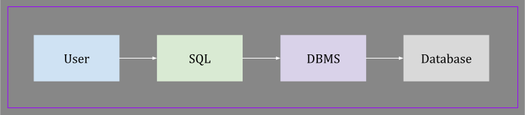
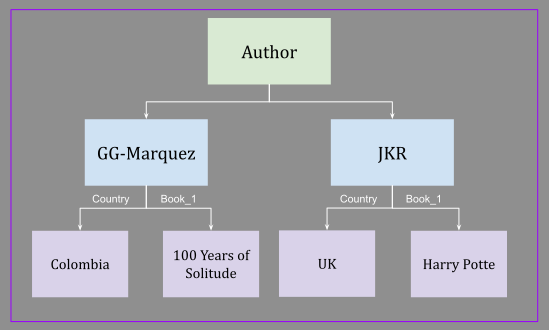
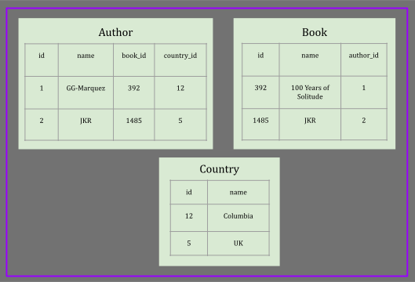
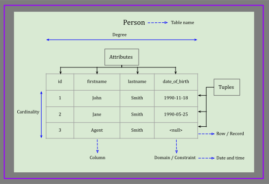

# SQL 

## Introduction

### Database
#### Definition 
- A system made of hardware to store and process data, and software to access and manage data
#### DBMS
- Short for database management system. 
- A software that manages databases by storing and manipulating data in a hardware.
#### Types of databases
1. Relational
   - MS SQL, MySQL, Postgres, etc. 
   - It supports ACID transactions.
   - It is made of tables (rows and columns).
2. Document
   - MongoDB, CouchDM, Fire Base.
   - Data is in big documents that contains related documents.
3. Key-Value
   - DynamoDB, Redis
   - Fast
   - A candidate for caching data
5. Graph
   - Neo4j, AWS Neptune.
   - Suitable if data are connected in different ways.
   - Such as social network data.
6. Wide Columnar
   - Pioneered by Google’s big table databases like Apache Cassandra.

#### RDBMS
- Short for relational database management system.
- A DBMS that is specified for relational databases
- SQL is an RDBMS programming language that stores and retrieves data.
- SQL Online Playground: [db-fiddle.com](https://www.db-fiddle.com/)
- Each row is a separate entity called a record.
  - Each column is a specific feature of an entity. For example: age, address, name.
    - Example of a table named **Employees** in a relational database:

| firstname | lastname | age |
|:---------:|:--------:|:---:|
|   John    |  Smith   | 28  |
|   Jane    |  Smith   | 26  |
|   John    |   Doe    | 31  |

#### Sample Query
- Query is also known as SQL statement
- Syntax: `SELECT <column-name> FROM <table-name>;`
- Example: `SELECT firstname from Employees;`
- The words `SELECT` and `FROM` are SQL reserved keywords.
- SQL keywords are case-insensitive.
- Example: `select firstname from Employees;`
- Note: Using uppercase for SQL reserved keywords is a better practice. It makes statements more readable.
- Column and table names are also case-insensitive as long as it is not wrapped in double quotes
- Example: `SELECT firstname from Employees;`
- Example: `SELECT Firstname from EMPLOYEES;`
- Example: `SELECT "firstname" from "Employees";`
- Query statement does not necessarily end at the end of a line
  - A query ends where SQL sees a semicolon.

### Declarative VS Imperative

#### Declarative Language
- User specifies **what** should happen
- How it's happening is not obvious
- SQL is a declarative language

#### Imperative Language
- User must specify how exactly something should happen
- Example: Java

### SQL VS SEQUEL

#### SEQUEL 
- The original name for SQL language
- Short for **Structured English Query Language**
- It had to be changed because of copyright conflict

#### SQL
- Is the true, official, and current name of this language
- Short for **Structured Query Language**
- It is made by IBM scientists in the 1970s.
- SQL is a standardized language.
- 


## History Of Database

### File Processing Systems
- It was similar to keeping files in a cabinet
- No correlation (=relationship) between files
- It was not possible for different system to communicate with each other. Hence, data had to be copied into different systems.

### Database Models

#### Hierarchical Model
- Old and deprecated
- Primarily used by IBM in the 60s and 70s.
- It is not an efficient model for storing data
- It has a tree-like structure
- Each parent node can have multiple children
- A child node can only have one parent (a single root)
- It is a one-to-many relationship
- It is similar to XML structure:
- XML example:
    ```
    <Authur>
        <Marquez>
          <Country>Colombia</Country>
          <Book>100 Years of Solitude</Book>
        </Marquez>
        <JKR>
          <Country>UK</Country>
          <Book>Harry Potter</Book>
        </JKR>
    </Authur>
    ```
- Deleting a parent would delete all its children information as well.
- Hierarchical model example:


#### Networking Model
- Old and deprecated
- Fixes the lack of many-to-many relationships between nodes.
- Example: if multiple authors contribute in writing a book.
- If a parent gets deleted, all its children would be removed as well.
- Conclusion: the tree like structure does not provide a general model for storing data.
- One solution: relational model

#### Relational Model
- Have one table to store information about authors
- Have one table to store information about books
- Link the two tables with primary keys and foreign keys
- Example:

- To build the many-to-many relationship between books and authors:
  - Remove the `author_id` column from the `Book` table.
  - Create another table that maps author ids to book ids.
- Primary key: is a column with unique values in a table. It is referred as `id` in the example above.
- Foreign key: is another table's primary key. It is used to build relationship between tables.

## DBMS

### CRUD
#### Create
- Create databases, tables, and add data

#### Read
- Read data from database

#### Update
- Change and update existing data

#### Delete
- Delete data, tables and databases

### What DBMS Does
#### Manage Data
- Manage data, store, and retrieve them.
#### Secure Data
- Define roles and permissions. Who can access for what operation on data.
#### Transaction Management
- Handle async processes

### MS SQL vs Oracle vs MySQL
- They all use SQL as common language in their DBMS
- They interact with data slightly different, handle hard drive differently, etc.
- Each has its own variation of SQL that can implement some extra features to compete with others.

### Codd's Rules
- Rules that define a database to be the correct RDBMS
- Codd presents his 13 rules for a database to test the concept of DBMS
  against his relational model, and if a database follows the rule, it is called a true relational database (RDBMS).
- Google `13 Rules of Codd`

### Relational Model

#### Terms
- A table is made of rows and columns
- Each table has a name
- Each column is a specific type of data. For example: date, number, string, etc.
- Each row is a specific entity. 
- Columns are defined when a table is being created
- Rows are the data we feed to the table
- Degree: the collection of all the columns in a table
- Attributes: similar to degree. Each attribute (or column) is a specific feature of data
- Domain/Constraint: is the type of data that is allowed in a column.
- Tuple/Record: is a single row of data. It is one record. It is an entity broken down to columns as a tuple.
- Cardinality: a collection of rows/tuples in a table


#### Primary Key
- Unique identifier for each row. 
- PK should not be nullable

#### Foreign Key
- PK of a table is a foreign to other tables
- FK is not necessarily unique
- FK is a way to reference data from one table to another.
- Multiple rows of a table can be associated to the same row of another table
- Using the PK of table `T1` as FK in `T2`, each one row of `T1` can be related to many rows of `T2` (one-to-many relationship)
- Example: One author might write multiple books. All those books in the `Book` table have the same `AuthorId` as foreign key

### OLTP vs OLAP
- They logically differ by their use case.
#### OLTP
- Short for **Online Transaction Processing**
- Databases that drive day to day transactions
- Example: in Amazon: databases that are used for manage customers data, orders data, transactions data, etc.

#### OLAP
- Short for **Online Analytical Processing**
- Put data in data warehouse and use it to analyze data.
- OLAP databases are created by data that captured and stored in OLTP databases.
- Use case: find what is valuable about data. 

#### Exercise
- Which one is OLTP vs OLAP?
  1. A database that logs customers and orders
  2. A databased being used to figure out what new products should be offered
  3. A database to drive statistics to be reported to executives
  4. A database to keep track of users
- Answer: Transactional database-Analytical database-Analytical database-Transactional database
- Losing an OLTP database has direct effect in day to day transactions
- Losing an OLTP database can also affect the ability of creating OLAP databases and analyzing capabilities
- Example: losing a customer database interrupts day to day transactions
- Example: losing a database that keeps tracking on users interrupts the analytical capabilities about the users behaviour
- A database that keeps data for tracked users can be used to build OLAP databases.

## PostgreSQL
### Postgres Docker Container
- Run the following command:

    `sudo docker container run -p 5432:5432 --name postgres -d -e POSTGRES_PASSWORD=password --restart always postgres`
- Set the password to something more secure

### Installed On Ubuntu
- To run postgres commands: `sudo -u postgres psql postgres`
- To see the list of databases: `\l+`
- Set password for user 'postgres': `\password postgres`

## SQL Commands

### SQL Command Categories
#### DCL
- Short for data control language
- Used for granting and revoking access
#### DDL
- Short for data definition language
- Setting up databases and tables
- Used for:
  - Create
  - Alter
  - Drop
  - Rename
  - Truncate
  - Comment
#### DQL
- Short for data query language
- It contains the `SELECT` statement

#### DML
- Short for data modification language
- Make changes to databases, tables, and data
- Used for:
  - Insert
  - Update
  - Delete
  - Merge
  - Call
  - Explain Plan
  - Lock Table

### SQL SELECT
- Used for query and retrieve data
- Base syntax: `SELECT <column-name> AS <column-alias> FROM <table-name> AS <table-alias>;`
- Separate multiple column identifiers by comma
- Use astrix (`*`) to select all columns.
#### CONCAT
- It concatenates two or more columns and name the result column as `concat`
- It does not modify the original table. It just applies to the retrieved data
- Example: `SELECT CONCAT(firstname, ' ', lastname) as "full name" FROM person;`
- Note: Use single quotes for strings in data
- Note: Use double quote for column and table names and aliasing
- A function like `CONCAT` will put its name ('concat') as column name by default unless an alias is specified

#### Functions:
- Aggregate functions: run all selected rows and return a single value
  - Example: `SUM`, `AVG`, `COUNT`, `MIN`, `MAX`
- Scalar functions: run on given columns separately on each row and return a single column
  - Example: `CONCAT`

#### Comment
- Single line comment: `-- the rest of the line after two dashes`
- Multiline comment: `/* all the lines betwee these two signs */`
- Add comments to complex queries

#### Filtering Data
- Use `WHERE` clause to add condition to the query.
- Example: limit the retrieved data to specific age range, range of salaries, person name, etc.
- Example: `SELECT firstname FROM person WHERE age >= 18`
- Conditions: >= > = < <= LIKE ILIKE IN ...
- Note: Check equality with single `=` instead of double `==`

#### Multiple Conditions
- To apply multiple filters, we can use `AND`, `OR`, and `NOT` keywords.
- Operator Precedence: `parentheses` > `NOT` > `AND` > `OR`
-   