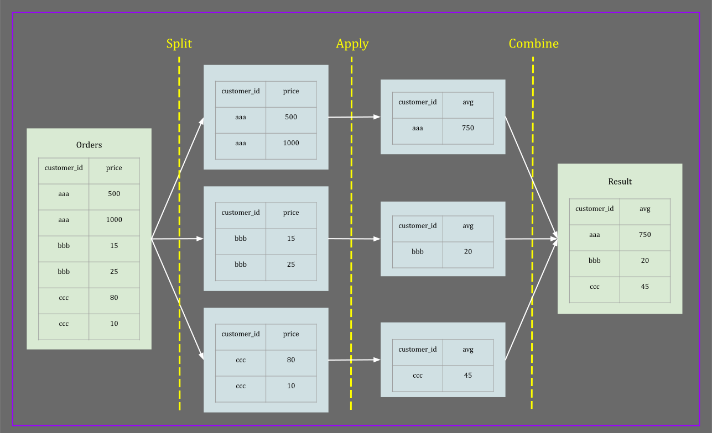

# SQL Intermediate

<a id="grouping-data"></a>
## Grouping Data

<a id="group-by"></a>
### Group By

- Need to group data: aggregate records based on a specific attribute.
  - Example: How many orders each customer has made.
  - Example: What is the average income of each department in a company.
  - Example: How much money is spent on each project on average over the past 20 years.
- Wrong solution (returns error):
  `SELECT customer_id, COUNT(order_id) FROM orders;`
  - Note: In the above SQL query, `customer_id` is a column but `COUNT(order_id)` is a single value.
- Correct solution:
  - Group records by `customer_id`, then count the number of orders in each group.  
  `SELECT customer_id, COUNT(order_id) FROM orders GROUP BY customer_id;`
  - `GROUP BY` creates a column of unique (distinct) customer IDs and aggregates orders in each group.
- `GROUP BY` splits data into groups or chunks which enables us to apply aggregate functions against groups rather than the entire table.'
- Group BY uses split, apply, combine strategy.
  1. Split data into groups with the same value of the attribute is getting grouped by.
  2. Apply the specified function to each group
  3. Combine results and create a single result table



<a id="having"></a>
### Having

- Use `HAVING` to apply filter against groups.
- Apply the filter on aggregate function itself.
- Example: Find customers average spending whom spend at least $1000 on average.  
  `SELECT customer_id, AVG(price) FROM orders GROUP BY customer_id Having AVG(price) > 1000;`

<a id="grouping-sets"></a>
### Grouping Sets

- Note: It is possible to make a union of the results of two select statements with the same degree.
- Example: 
    ```
  SELECT old_clients AS customers, address FROM customers_prev
  UNION
  SELECT current_clients AS customers, address FROM customers;
    ```
- If there are similar records, `UNION` would prevent the duplication.
- Use `UNION ALL` to allow duplication.
- The problem that `GROUPING SET` solves.
  - `GROUPING SET` equivalents to union of multiple `GROUP BY` select statements allowing duplications.
- Example: 
  ```
  SELECT customer_id, order_date, SUM(order_prices) FROM orders 
  GROUP BY 
      GROUPING SETS (
          (customer_id, order_date),
          (customer_id),
          (order_date),
          ()
      );
  ```
- The above statement is equivalent to:
  ```
  SELECT customer_id, order_id, SUM(order_prices) FROM orders
  GROUP BY customer_id, order_date
  UNION ALL
  SELECT customer_id, NULL AS order_id, SUM(order_prices) FROM orders
  GROUP BY customer_id
  UNION ALL
  SELECT NULL AS customer_id, order_id, SUM(order_prices) FROM orders
  GROUP BY order_date
  UNION ALL
  SELECT NULL AS customer_id, NULL AS order_id, SUM(order_prices) FROM orders
  ```
  
<a id="rollup"></a>
### Rollup
- Consider the following select statement:  
 ```
  SELECT EXTRACT (YEAR FROM order_date) AS "year", 
         EXTRACT (MONTH FROM order_date) AS "month",
         EXTRACT (DAY FROM order_date) AS "day",
         SUM(orders.price)
  GROUP BY 
      GROUPING SETS (
          <all combinations of year, month, day>
      )
  ORDER BY
         year, 
         month,
         day
 ```
- If it is required to use all combinations of the year, month, and day in  the grouping sets, you can use `ROLLUP` instead.

Example:
 ```
  SELECT EXTRACT (YEAR FROM order_date) AS "year", 
         EXTRACT (MONTH FROM order_date) AS "month",
         EXTRACT (DAY FROM order_date) AS "day",
         SUM(orders.price)
  GROUP BY 
      ROLLUP (
          year, month, day
      )
  ORDER BY
         year, 
         month,
         day
 ```

## Window

- Window functions create a new column based on functions performed on a subset or **window** of the data.
- 
