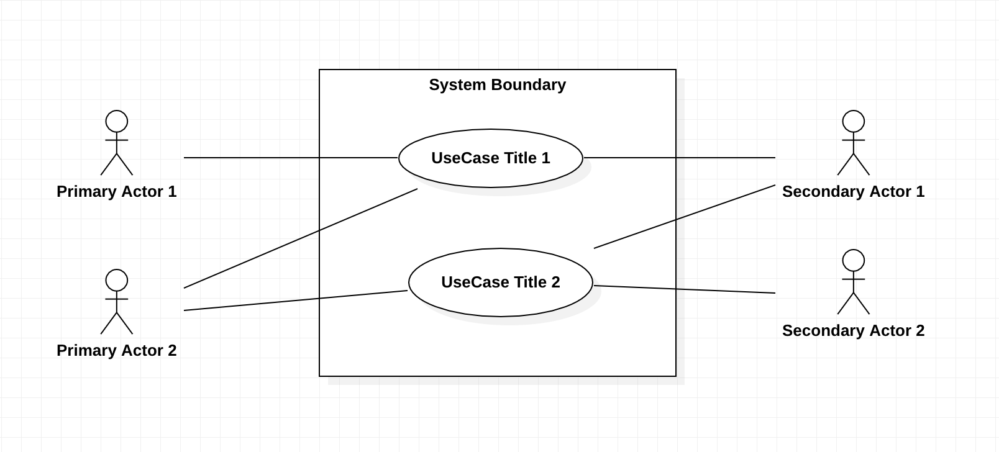

# Use-case And User Story

## Introduction
Describe your application intention by answering the following question:
- How does a certain user accomplish a goal with our application?

This description is focused on how user interacts with the application  
A typical user of this application should be able to read the description and understand it

Two ways to describe a user interaction:
1. Use case
2. User story

## Use Case

Essential Ingredients
- Title: it is the goal of the use-case
- Actor: person or user type
- Scenario: a series of steps to accomplish the goal. It is the success scenario

### Title
- Title is a short phrase with an active verb. Example: purchase items in a cart

### Actor
- Actor identifies whom having the interaction with the application. Example: public user, member, admin, employee, partner, etc.
- An actor can be another computer system, service, or an external entity. Any external entity that acts on our system is an actor
- Actors are outside our system, and they have goals to accomplish within our system
- You can start by separating human and non-human interactions (human actors and non-human actors)
- Primary actor: is the actor who initiates this particular use case
- Secondary actors: all other actors

### Scenario
- Scenario describes a complete encounter between the actor and our system
- Scenario can even include sections for parts that can go wrong
- Scenario describes a goal that an actor can accomplish in a single encounter
- Example:
  1. navigate (or search) in products
  2. add item(s) to cart
  3. view cart
  4. proceed to checkout
  5. select delivery options
  6. verify item availability
  7. verify payment method
  8. make the purchase
  9. report status of transaction to user
  10. verify and show tracking information
  11. email the user
- Example: log in to a system is normally not a user-focused goal. Hence, it cannot be a use case. It can be a step in the scenario

Optional ingredients:
- Pre-Condition: what must be true to begin the use-case
  - Example: user must be logged in to their account
- Extensions: they are extensions to the success scenario. They are steps for alternative flows
  - Example:
    - Extension: item out of stock
    - Extension: payment declined
    - Extension: client is not logged in yet
    - Extension: connection error while processing payment
  - With extensions, try not to lay out all possible events, just typical situations that could occur

Other less frequently used ingredients:
- Scope
- Level
- Stakeholders
- Special requirements
- Frequency of occurrence

Note: Use case diagrams help support written use cases and not replacing them

## User Story
User story is simpler and shorter than a use case
- It describes a single scenario from a user’s perspective
- It is written as just one or two sentences
- You can use the following format for user stories
  - **As a** (user or role) **I want** (a particular goal) **So that** (benefit from the goal)
  - Example: **As a** public user, **I want** to be able to search in products, **so that** I can be sure my favourite products exist before I become a member
  - Example: **As a** registered user, **I want** to be able to add items to a watch list, **so that** I get notified when the item becomes available
- We are not detailing alternate paths or extensions in a user story
- Our focus is just on the intent, and we express only one need
- User story is a very quick readable summary of what a specific goal is and why the user wants it

## User Story vs Use-case
- User story is a placeholder for a conversation. It’s a reminder that we need to get into the details of something
- Use case can be considered as a record of a conversation that already happened
- You work with user stories if you are working in a scrum environment
- Use case is a more formal unified process methodology you’d use 

## Use Case Diagram
- We do not dive into details of each use-case as we did for written use-cases
- It does not necessarily represent a single use-case, but several use-cases and multiple actors at the same time
- It is a high level overview of the relationship between the use-cases, actors, and services in our system

