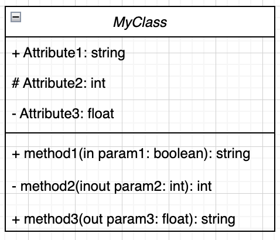
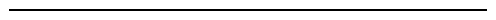
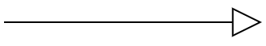

# Class Diagram

## Representation
- A square that is made of three parts
  1. Class name (must be specified)
  2. Attributes (PascalCase)
  3. Methods (camelCase)

#### Note: from the three sections above, any class model must have a name. The other parts should be mentioned if they exist.
####Note: type of attributes and methods should be specified after colon (: type)
####Note: methods parameters should also be specified with their type

## Access Modifiers
1. Public: +
2. Private: -
3. Protected: #
4. Package Local: ~

## Method Parameters Direction
1. in: method uses the value of the parameter. But it does not modify it (read only)
2. out: method only changes the value of the parameter, but does not read it.
3. inout: methods both reads the value of the parameter and writes to it. 

## Relationships
### Association  

### Inheritance  

### Realization

### Dependency

### Aggregation

### Composition

